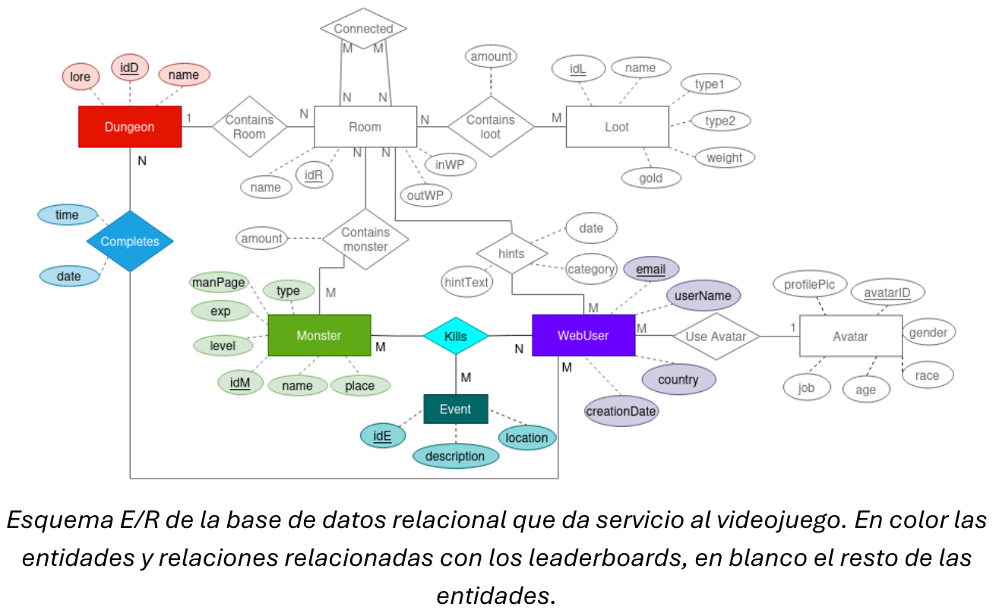
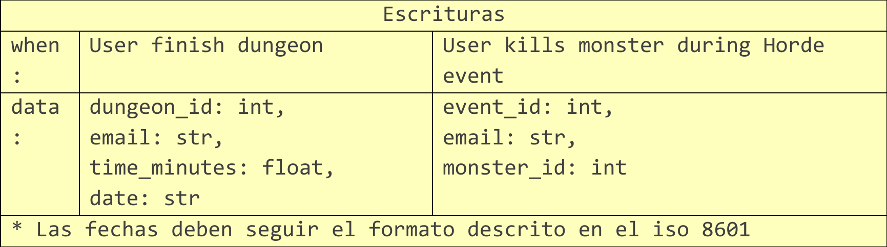

<div align="center">

--- 

# Base de Datos II
## Práctica de Cassandra
### Pablo Ariño, Álvaro Laguna, Jorge de la Rosa
### Ciencia de Datos e Inteligencia Artificial


---
</div>

## Introducción
En el videojuego “Jotun’s Lair” de la empresa “Norsewind studios”, existen unos
leaderboards que muestran los tiempos que han tardado los usuarios en completar las
mazmorras. 

Sin embargo, en los últimos años, el juego ha cogido mucha popularidad y el
número de jugadores y países donde se vende el juego creció mucho. El equipo de
operaciones ha notado que la base de datos relacional que usan no cumple con los
objetivos de rendimiento ni de escalabilidad necesarios para dar soporte a los
leaderboards del juego.

<div align="center">

</div>
<br>
En concreto, los jugadores pueden examinar tres *leaderboards* que se deben ir actualizando en tiempo real:

### Hall of Fame
El “**hall of fame**” de cada país, es decir, para un país concreto se muestran
para cada mazmorra del juego el TOP 5 de jugadores más rápidos de ese país, incluyendo sus tiempos.

> [!IMPORTANT]
> Un pequeño retardo a la hora de actualizar o mostrar estos leaderboards no tiene impacto en el juego.

### Estadísticas de un jugador
Muestra los tiempos que ha tardado en
completar una mazmorra en particular ordenados de menor a mayor.

> [!IMPORTANT]
> Un pequeño retardo a la hora de actualizar o mostrar estos leaderboards no tiene impacto en el juego.

### Hordas
El equipo de “game design” quiere introducir un leaderboard para las Hordas que muestre los N jugadores que más monstruos han matado hasta el momento durante una Horda en concreto.

Una Horda es un evento especial del juego en la que los jugadores deben resistir en una fortaleza del mapa oleadas de monstruos que tratan de conquistar la fortaleza.

> [!IMPORTANT]
>
> - Una Horda tiene una duración de unos 30-40 minutos.
> - Cualquier retraso a la hora de enviar/recibir la información es crítico.
> - La consistencia en este leaderboard no es tan importante.


## Objetivo

Se desea realizar un prototipo de una base de datos de Cassandra para dar servicio a los tres leaderboards anteriores. El juego hace tres peticiones de lectura al servidor que se resumen en la siguiente tabla:

<div align="center">

</div>
<br>

La fila "rank" indica el leaderbord que se puebla con la
petición de lectura, la fila "in" indica los parámetros de entrada que recibe la llamada y "out" indica el formato de los datos que devuelve el servidor.

Además, el juego hace dos peticiones de escritura al servidor que se ejecutan cuando
ocurre un evento concreto durante el juego. La siguiente tabla muestra la información de
las peticiones de escritura, la fila “When” indica el evento en el juego que dispara la
petición de escritura y la fila “data” indica los datos que se envían al servidor: 

<div align="center">

</div>

## Tareas
1. Diseña una base de datos Cassandra para dar servicio a las lecturas y escrituras
anteriores. Argumenta tus decisiones de diseño.

1. Crea las consultas .sql necesarias para exportar los datos de la base de datos
relacional a ficheros .csv. Los ficheros deberán tener un formato acorde al diseño
del punto 1.

1. Prepara un cluster local de 3 nodos todos en el mismo rack y datacenter.
   
2. Haz un fichero .cql que creen tu diseño en Cassandra y cargue los ficheros .csv
creados en el paso 2. Se debe utilizar un factor de replicación de 2 y tener en
cuenta que se las pruebas se ejecutaran en un cluster local.

1. OPCIONAL Si el diseño lo necesita, actualiza la tabla de escrituras para incluir
cualquier modificación que sea necesaria en la información que se le debe
proporcionar al servidor.

1. Haz un fichero .cql que realice las consultas de escritura y lectura necesarias.
Incluye el nivel de consistencia de cada consulta, teniendo en cuenta las
características de los diferentes rankings.

# SOLUCIÓN

## 1. Creación de la base de datos

## 2. Exportación de datos a csv

### Hall of fame
Primero, **migramos** los datos de la base de datos de SQL. Para ello, nos quedamos con los 5 mejores jugadores de cada mazmorra por país. También, obtendremos el nombre de la mazmorra, el nombre de usuario, el tiempo que ha tardado en completarla y la fecha en lograrlo. Estos resultados los volcamos a un archivo csv.
```SQL
SELECT email, country, idD, lowest_time, date, name, userName
FROM (
	SELECT w.email, country, d.idD, MIN(time) lowest_time, date, name, w.userName, ROW_NUMBER() OVER (PARTITION BY country, d.idD ORDER BY MIN(time), w.email) AS indx
	FROM WebUser w
	JOIN CompletedDungeons cd ON cd.email = w.email
	JOIN Dungeon d ON cd.idD = d.idD
	GROUP BY w.email, d.idD, country, date, name, w.userName
	ORDER BY country, d.idD, lowest_time, w.email
) AS t
WHERE indx <= 5
INTO OUTFILE '/var/lib/mysql-files/HallofFame.csv'
FIELDS TERMINATED BY ',' ENCLOSED BY '"'
LINES TERMINATED BY '\n';

```
Una vez obtenemos el csv con los datos migrados, procedemos a montar la base de datos de Cassandra. Comenzaremos ejecutando el comando para llamar a cqlsh y modificaremos el *timeout* para no tener poblemas tanto en importación como exportación de los datos.
```sh
cqlsh --request-timeout=10000
```
Ahora, crearemos primero nuestro *Keyspace*. El nombre que le daremos será *Dungeon*. Al estar ubicado en un mismo *datacenter* utilizaremos `SimpleStrategy` con un facor de replicación de 2.

```sql
CREATE KEYSPACE Dungeons
WITH replication = {'class': 'SimpleStrategy',
                    'replication_factor': 2};
USE dungeons;
```

Debido a que la migración no supone un estancamiento en el funcionamiento del juego, vamos a establecer una consistencia de tipo `ALL` en la etapa de migración para asegurarnos que empezamos con todos los datos en los nodos que hemos definido. 
```sql
CONSISTENCY ALL;
```

A continuación, creamos nuestra tabla donde vamos a alojar los datos. Las variables de tipo texto se han definido como `VARCHAR`, ya que no consideramos que se requiera de más espacio en memoria para estas. Por otro lado, designamos `TINYINT` para el tiempo. Estimamos que se tardará menos de 127 min en completar en una mazmorra, ya que, tras un estudio de los datos, ninguno de los jugadores a nivel global ha tardado más de 49 minutos. Por otra parte, estimamos que en un futuro se amplien a más de las 19 mazmorras actuales, superando las 127, por lo que usaremos `INT`. Dado que las mazmorras se dividen por país, establecemos como clave de partición `country`. Por otro lado, usamos `dungeon_id`, `lowest_time` y `email` para que los datos de los nuevos jugadores entren ordenados a la base de datos.
```sql
CREATE TABLE hall_of_fame (
    country VARCHAR,
    dungeon_id INT,
    dungeon_name VARCHAR,
    email VARCHAR,
    username VARCHAR,
    lowest_time TINYINT,
    date TIMESTAMP,
    PRIMARY KEY (country, dungeon_id, lowest_time, email)
);
```
Cargamos los datos de nuestro archivo csv mediante la siguiente instrucción:
```sql
COPY hall_of_fame (email, country, dungeon_id, lowest_time, date, dungeon_name, username) 
FROM '/csv/HallofFame.csv' WITH HEADER = false;
```
La solución que hemos propuesto permite obtener el listado de jugadores dado un país y mazmorra, con la posibilidad de modificar el ranking deseado de usuarios sin ningún problema de rendimiento. Para las operaciones de lectura, modificaremos la consistencia a una más adecuada. En este caso, nos limitaremos a tener mínimo la respuesta de dos nodos, para garantizar que los datos son fieles a la realidad en cierta medida.
```sql
CONSISTENCY TWO;

SELECT *
FROM hall_of_fame
WHERE country = <pais_deseado> AND dungeon_id = <id_mazmorra_deseada>
LIMIT 5;
```
Esta arquitectura permite una lectura inmediata ya que los datos ya están ordenados en Cassandra. Para las llamadas de API de loc clientes, sin embargo, debemos hacer una query por cada mazmorra y juntar todos los resultados en una lista. Sin embargo, consideramos que esta solución es la más adecuada tanto en lectura como en escritura. Una de las debilidades principales de esta arquitectura es la necesidad de una consulta por mazmorra y juntar los resultados en la lista, pero consideramos que esto es menos costoso que tener varios jugadores en una misma fila de la BBDD, ya que, aunque la lectura sería inmediata, complicaría drásticamente la insersión de nuevos datos en la tabla, a la vez que desaprovechamos el potencial de Cassandra de poder insertar los datos de manera ordenada.

# <FALTA PONER COMO INSERTAR DATOS AQUÍ>

### Player Statistics
Para este caso de uso, volvemos a migrar a un csv los datos de SQL. Esta vez, migramos solamente el email, el ID de la mazmorra, el tiempo que ha tardado en completarlo y la fecha de completación.
```SQL
SELECT email, idD, time, date
FROM CompletedDungeons
ORDER BY email, idD, time ASC
INTO OUTFILE '/var/lib/mysql-files/Statistics.csv'
FIELDS TERMINATED BY ',' ENCLOSED BY '"'
LINES TERMINATED BY '\n';
```

Nuevamente, establecemos la consistencia de la escritura.
```sql
CONSISTENCY ALL;
```

Ahora, creamos la tabla de estadísticas. Las decisiones de los tipos de datos son las mismas que en *Hall of Fame*. En este caso, obtamos por dividir los datos entre los nodos (clave de partición) mediante el email del usuario.
```sql
CREATE TABLE player_statistics (
    dungeon_id INT,
    email VARCHAR,
    lowest_time TINYINT,
    date TIMESTAMP,
    PRIMARY KEY (email, dungeon_id, lowest_time)
);
```
Cargamos los datos de nuestro archivo csv mediante la siguiente instrucción:
```sql
COPY player_statistics (email, dungeon_id, lowest_time, date) 
FROM '/csv/Statistics.csv' WITH HEADER = false;
```
Igual que el problema anterior, esta solución permite una insersión inmediata de manera ordenada, aprovechando al máximo el potencial de Cassandra. La consistencia empleada es la misma que en *Hall of fame*
```sql
CONSISTENCY TWO;

SELECT *
FROM player_statistics
WHERE email = <email_del_usuario>
LIMIT 5;
```

# <FALTA PONER PORQUE ES LA MEJOR SOLUCIÓN>
# <FALTA PONER COMO INSERTAR DATOS AQUÍ>

### Hordas
Finalmente, para el caso de las hordas, vamos a migrar la siguiente información al archivo csv. Obtenemos la información del país del usuario, el ID del evento (horda), el nombre de usuario, su identificador y el contador de muertes logrado por el usuario.
```SQL
SELECT WebUser.country, Kills.idE, WebUser.userName, WebUser.email, COUNT(*) n_kills
FROM Kills
JOIN WebUser ON Kills.email = WebUser.email
GROUP BY Kills.idE, WebUser.country, WebUser.userName, WebUser.email
ORDER BY WebUser.country ASC, Kills.idE ASC, n_kills DESC, WebUser.userName ASC
INTO OUTFILE '/var/lib/mysql-files/Hordas.csv'
FIELDS TERMINATED BY ',' ENCLOSED BY '"'
LINES TERMINATED BY '\n';
```

Nuevamente, establecemos la consistencia de la escritura.
```sql
CONSISTENCY ALL;
```

Para este caso, determinamos que nuestra empresa de videojuegos ampliará en un futuro el número de eventos, superando los 127 eventos distintos, por lo que establecemos a `INT` el tipo de dato.
Preveemos también que los usuarios serán capaces de superar este número en cuanto a muertes, por lo que también lo establecemos como `INT`. En nuestro diseño, decidimos usar como clave de partición
el país y la ID del evento, ya que esto optimiza los tiempos de busqueda de la [información](https://www.scylladb.com/glossary/cassandra-clustering-key/#:~:text=The%20Cassandra%20partition%20and%20clustering,facilitates%20efficient%20queries%20and%20data), más de lo que lograríamos estableciendo `event_id` como clave de *clustering* 
```sql
CREATE TABLE hordas(
    country VARCHAR,
    event_id INT,
    username VARCHAR,
    email VARCHAR,
    n_kills INT,
    PRIMARY KEY ((country, event_id), n_kills, email)
) WITH CLUSTERING ORDER BY (n_kills DESC, email ASC);
```
Cargamos los datos de nuestro archivo csv mediante la siguiente instrucción:
```sql
COPY hordas (country, event_id, username, email, n_kills) 
FROM '/csv/Hordas.csv' WITH HEADER = false;
```
Igual que el problema anterior, esta solución permite una insersión inmediata de manera ordenada, aprovechando al máximo el potencial de Cassandra. La consistencia empleada es una menos que en *Hall of fame*, ya que necesitamos poder acceder a la información en tiempo real.
```sql
CONSISTENCY ONE;

SELECT *
FROM horda
WHERE country = <pais_deseado> AND <id_del_evento>
LIMIT 5;
```

# <FALTA PONER PORQUE ES LA MEJOR SOLUCIÓN>
# <FALTA PONER COMO INSERTAR DATOS AQUÍ>


