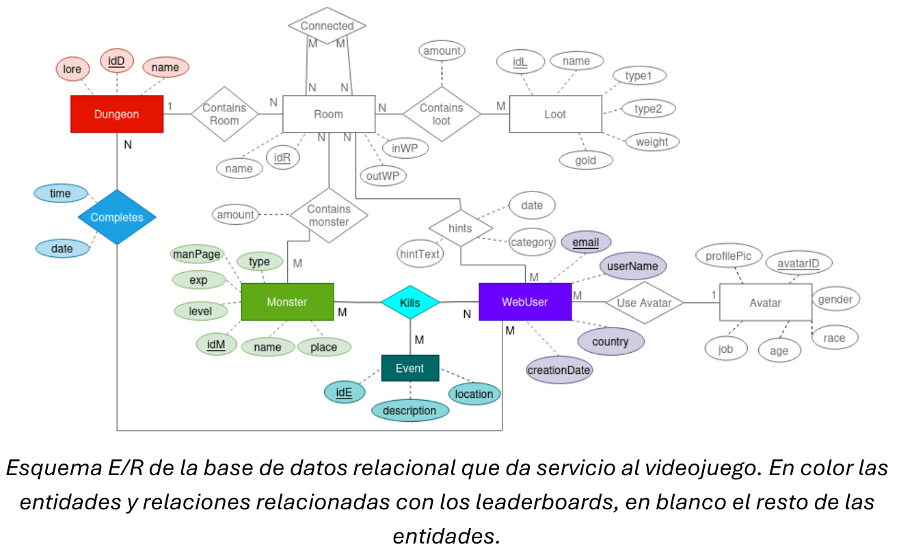
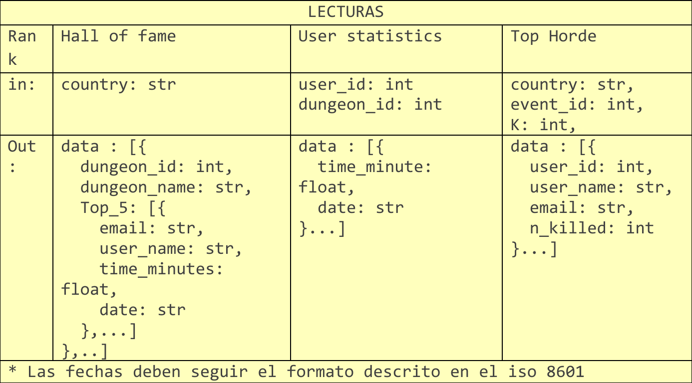
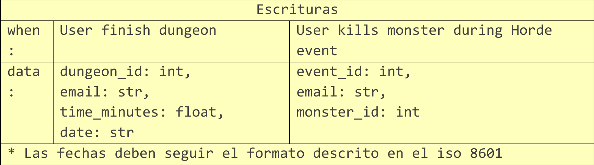

--- 

# Base de Datos II
## Práctica de Cassandra
### Pablo Ariño, Álvaro Laguna, Jorge de la Rosa
### Ciencia de Datos e Inteligencia Artificial

---

## Introducción
En el videojuego “Jotun’s Lair” de la empresa “Norsewind studios”, existen unos
leaderboards que muestran los tiempos que han tardado los usuarios en completar las
mazmorras. 

Sin embargo, en los últimos años, el juego ha cogido mucha popularidad y el
número de jugadores y países donde se vende el juego creció mucho. El equipo de
operaciones ha notado que la base de datos relacional que usan no cumple con los
objetivos de rendimiento ni de escalabilidad necesarios para dar soporte a los
leaderboards del juego.

 
En concreto, los jugadores pueden examinar tres *leaderboards* que se deben ir actualizando en tiempo real:

### Hall of Fame
El “**hall of fame**” de cada país, es decir, para un país concreto se muestran
para cada mazmorra del juego el TOP 5 de jugadores más rápidos de ese país, incluyendo sus tiempos.

> [!IMPORTANT]
> Un pequeño retardo a la hora de actualizar o mostrar estos leaderboards no tiene impacto en el juego.

### Estadísticas de un jugador
Muestra los tiempos que ha tardado en
completar una mazmorra en particular ordenados de menor a mayor.

> [!IMPORTANT]
> Un pequeño retardo a la hora de actualizar o mostrar estos leaderboards no tiene impacto en el juego.

### Hordas
El equipo de “game design” quiere introducir un leaderboard para las Hordas que muestre los N jugadores que más monstruos han matado hasta el momento durante una Horda en concreto.

Una Horda es un evento especial del juego en la que los jugadores deben resistir en una fortaleza del mapa oleadas de monstruos que tratan de conquistar la fortaleza.

> [!IMPORTANT]
>
> - Una Horda tiene una duración de unos 30-40 minutos.
> - Cualquier retraso a la hora de enviar/recibir la información es crítico.
> - La consistencia en este leaderboard no es tan importante.

## Objetivo

Se desea realizar un prototipo de una base de datos de Cassandra para dar servicio a los tres leaderboards anteriores. El juego hace tres peticiones de lectura al servidor que se resumen en la siguiente tabla:

 

La fila "rank" indica el leaderbord que se puebla con la
petición de lectura, la fila "in" indica los parámetros de entrada que recibe la llamada y "out" indica el formato de los datos que devuelve el servidor.

Además, el juego hace dos peticiones de escritura al servidor que se ejecutan cuando
ocurre un evento concreto durante el juego. La siguiente tabla muestra la información de
las peticiones de escritura, la fila “When” indica el evento en el juego que dispara la
petición de escritura y la fila “data” indica los datos que se envían al servidor: 

## Tareas
1. Diseña una base de datos Cassandra para dar servicio a las lecturas y escrituras
anteriores. Argumenta tus decisiones de diseño.

1. Crea las consultas .sql necesarias para exportar los datos de la base de datos
relacional a ficheros .csv. Los ficheros deberán tener un formato acorde al diseño
del punto 1.

1. Prepara un cluster local de 3 nodos todos en el mismo rack y datacenter.
   
2. Haz un fichero .cql que creen tu diseño en Cassandra y cargue los ficheros .csv
creados en el paso 2. Se debe utilizar un factor de replicación de 2 y tener en
cuenta que se las pruebas se ejecutaran en un cluster local.

1. OPCIONAL Si el diseño lo necesita, actualiza la tabla de escrituras para incluir
cualquier modificación que sea necesaria en la información que se le debe
proporcionar al servidor.

1. Haz un fichero .cql que realice las consultas de escritura y lectura necesarias.
Incluye el nivel de consistencia de cada consulta, teniendo en cuenta las
características de los diferentes rankings.