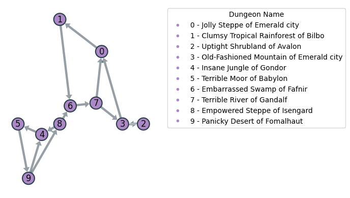
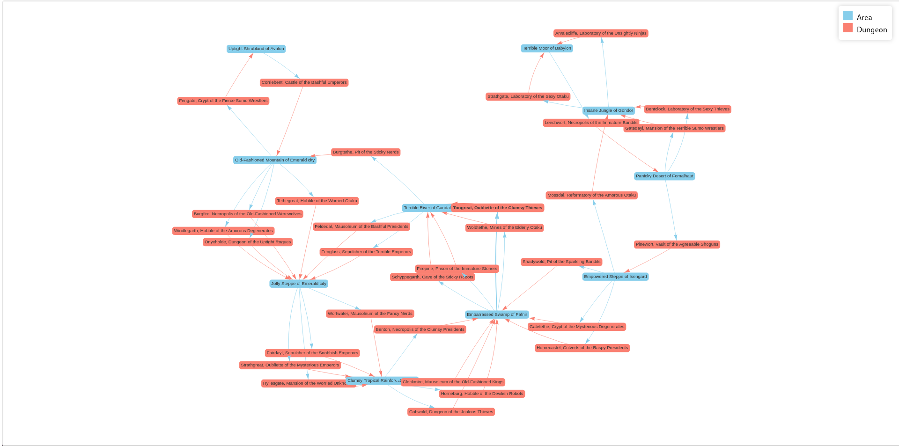
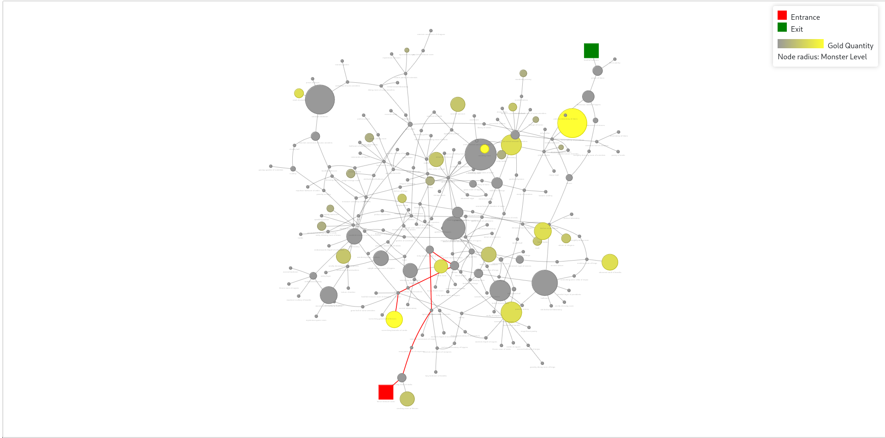

<div align="center">

--- 

# Base de Datos II
## Práctica de Neo4j
### Pablo Ariño, Álvaro Laguna, Jorge de la Rosa
### Ciencia de Datos e Inteligencia Artificial


---
</div>

<p align="center">
  
</p>
<p align="center">
  Figura 1: Esquema de la base de datos
</p>

# Configuración del entorno
## Carga de la base de datos
Para cargar la base de datos, se debe ejecutar el siguiente comando:
```bash
docker run -it --tty --rm --user=$(id -u):$(id -g) --volume=$PWD/data:/data --volume=$PWD/import:/backups neo4j/neo4j-admin:5.13.0 neo4j-admin database load dungeons --from-path=/backups
```
> [!NOTE]
> Si se quiere cargar la base de datos en Windows, se debe usar el siguiente comando en PowerShell:
> ```bash
> docker run -it --tty --rm  --volume=$PWD/data:/data --volume=$PWD/import:/backups neo4j/neo4j-admin:5.13.0 neo4j-admin database load dungeons --from-path=/backups

## Despliegue de los contenedores
En este directorio se encuentra un archivo .env.template, del que se debe hacer una copia llamada .env y cambiar los valores de las variables de entorno según se desee. 

Una vez hecho esto, para desplegar los contenedores de Neo4j y Jupyter, se debe ejecutar el siguiente comando:
```bash
docker compose up
```
> [!NOTE]
> Si se quiere desplegar en Windows, se debe usar el archivo `docker-compose-windows.yml` en lugar de `docker-compose.yml` con el siguiente comando:
> ```bash
> docker compose -f docker-compose-windows.yml up
> ```
Una vez desplegado, se puede acceder a la interfaz web de Neo4j en [http://localhost:7474](http://localhost:7474) y a Jupyter en [http://localhost:8899](http://localhost:8899) con la contraseña `neo4j`.

> [!NOTE]
> Por defecto, el puerto de Jupyter es el 8899, pero se puede cambiar en el archivo .env

# Solución propuesta

Puesto que algunas consultas crean propiedades de las que luego se aprovechan otras posteriormente, es posible que alguna no funcione si no se han ejecutado las consultas de las que esta depende. Es por este motivo, que se recomienda ejecutarlas en el orden mostrado a continuación.

## Desde la interfaz web
### 1. Buscar todas las salas de todas las mazmorras que contengan un tesoro en particular.
```cypher
MATCH (r:Room)-[:CONTAINS]->(l:Loot)
WHERE l.name = "Net"
RETURN r;
```
### 2. Obtener todos los monstruos que hay en una sala en particular.
```cypher
MATCH (r:Room)-[:CONTAINS]->(m:Monster)
WHERE r.room_name = "crypt "
RETURN m;
```
### 3. Obtener todos los monstruos que no están presentes en ninguna sala.
```cypher
MATCH (m:Monster)
WHERE NOT ()-[:CONTAINS]->(m)
RETURN m;
```
### 4. Calcular el camino más corto de un área a otra área.
```cypher
MATCH
  (a:Area {name: "Panicky Desert of Fomalhaut"}),
  (b:Area {name: "Terrible River of Gandalf"}),
  p = shortestPath((a)-[:IS_CONNECTED*]->(b))
RETURN length(p)
```
### 5. Mostrar los enemigos que es necesario derrotar para ir de un área del juego a otra por el camino más corto.
```cypher
MATCH
  (a:Area {name: "Panicky Desert of Fomalhaut"}),
  (b:Area {name: "Terrible River of Gandalf"}),
  p = shortestPath((a)-[:IS_CONNECTED*]->(b))
MATCH (r:Room)-[:CONTAINS]->(m:Monster)
WHERE r IN nodes(p)
RETURN m;
```
### 6. Crear una nueva arista que conecta las distintas áreas del juego, las aristas deben tener un atributo peso con la longitud del camino más corto que unen las dos áreas.
```cypher
MATCH (a: Area),
      (b: Area),
      (a)-[ca:IS_CONNECTED]->(),
      ()-[cb:IS_CONNECTED]->(b),
       p = shortestPath((a)-[:IS_CONNECTED*]->(b))
WHERE a <> b AND ca.dungeon_name = cb.dungeon_name
MERGE (a)-[r:SHORTEST_PATH{length: length(p)}]->(b);
```
### 7. Mostrar el mapa-mundi del juego, es decir, las áreas que contiene y como están conectadas.
```cypher
MATCH (a:Area)-[r:SHORTEST_PATH]->(b:Area)
RETURN a, r, b;
```
### 8. Crear un atributo nuevo en las habitaciones que contenga el nombre de la mazmorra a la que pertenecen.
Primero, se crea una proyección de la base de datos dejando solo los nodos de tipo Room y las relaciones de tipo IS_CONNECTED.
```cypher
CALL gds.graph.project('roomGraph', 'Room', 'IS_CONNECTED');
```
Luego, se escribe en la base de datos el atributo componentId
```cypher
CALL gds.wcc.write('roomGraph', { writeProperty: 'componentId' })
YIELD nodePropertiesWritten, componentCount;
```
Finalmente, se escribe en la base de datos el atributo dungeon_name
```cypher
MATCH (a: Area)-[i: IS_CONNECTED]->(r: Room)
WITH i.dungeon_name AS dungeon_name, r
MATCH (r2: Room)
WHERE r2.componentId = r.componentId
SET r2.dungeon_name = dungeon_name;
```
Opccionalmente, se puede borrar el atributo componentId
```cypher
MATCH (r: Room)
REMOVE r.componentId;
```

## Desde Python

Las queries se encuentran en el siguiente [notebook](./sources/queries.ipynb)

## Visualización

### 1. **Mapamundi**: El mapamundi debe mostrar las distintas áreas del juego y como se interconectan unas con otras.
<p align="center">
  
</p>

### 2. **Listado mazmorras**: El listado de mazmorras debe mostrar todas las mazmorras del juego y las áreas con las que están conectadas. Debería ser capaz de ver a simple vista que mazmorras están en cada área y mazmorras hacen de puente entre dos áreas.

<p align="center">
  
</p>
<p align="center">
  <a href="./sources/listado_mazmorras.html">Link a la visualización interactiva</a>
</p>

### 3. **Mini-mapa mazmorra**: Dada una mazmorra el mini mapa debe mostrar información que ayude a los aventureros a explorar la mazmorra. En el mini mapa debe ser fácil reconocer las entradas y las salidas de una mazmorra. Los pasillos que llevan a salas interesantes. Las zonas donde hay monstruos o tesoros y el nivel/precio de estos

<p align="center">
  
</p>
<p align="center" href="./sources/minimapa_mazmorra.html">
  <a href="./sources/minimapa_mazmorra.html">Link a la visualización interactiva</a>
</p>

En esta visualización, el camino marcado en rojo es el camino más corto entre la entrada y la sala con más tesoros valiosos.

El código usado para generar las visualizaciones se encuentran en el siguiente [notebook](./sources/visualization.ipynb)

## Filtro colaborativo

El filtro colaborativo se encuentra en el siguiente [notebook](./sources/collaborative_filtering.ipynb)