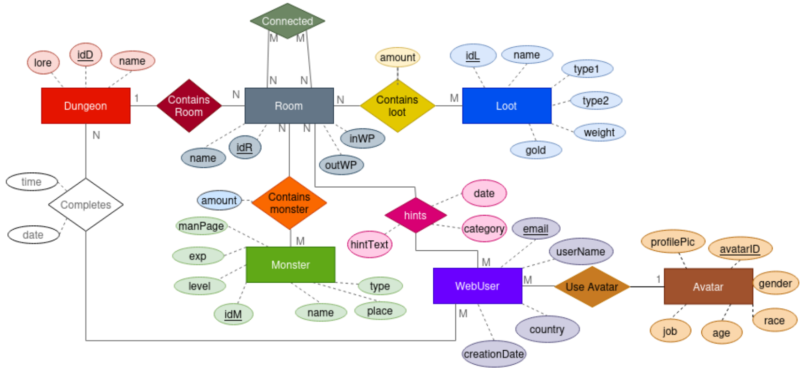

<div align="center">

--- 

# Base de Datos II
## Práctica de MongoDB
### Pablo Ariño, Álvaro Laguna, Jorge de la Rosa
### Ciencia de Datos e Inteligencia Artificial


---
</div>

# Enunciado

Le empresa de “Norsewind Studios” tiene una wiki de su videojuego “Jotun’s Lair” que contiene información y lore sobre los monstruos, el loot del juego y las mazmorras. Además, permite a los usuarios dejar comentarios sobre su experiencia con el videojuego. Los usuarios pueden dejar comentarios sobre las siguientes temáticas:

- Lore: Teorías e información relacionadas con la historia del juego.
- Hint: Trucos y consejos para otros jugadores.
- Suggestion: Sugerencias de los usuarios para mejorar algún aspecto del juego.
- Bug: Reportes de posibles fallos que ocurren durante el gameplay.

La empresa tiene una API REST para dar servicio a la wiki. Hasta ahora, se viene usando una base de datos relacional, pero últimamente, debido al alto volumen de jugadores, el sistema se está viendo sobre saturado. Por esa razón, se ha decidido migrar de una base de datos relacional a una base de datos de documentos para probar si así se solventan los problemas. A continuación, las entidades de la base de datos relacional que estarán involucradas en el prototipo

<p align="center">
  
</p>
<p align="center">
  Bases de datos relacional que da servicio a la wiki del juego. La parte coloreada es la parte que usaremos en esta práctica.
</p>

# Configuración del entorno

## Despliegue del contenedor

Para desplegar el contenedor de MongoDB, se debe ejecutar el siguiente comando:

```bash
docker compose up
```

Una vez desplegado, se puede acceder,mediante MongoDB Compass, a la base de datos en `localhost:27017`.

## Carga de la base de datos

Para cargar la base de datos, desde MongoDB Compass, se debe crear una nueva base de datos llamada `dungeons` y cuatro colecciones:

- Loot
- Monster
- Rooms
- Users

Una vez creadas, se deben importar los datos de los ficheros `loot.json`, `monster.json`, `rooms.json` y `users.json` en las colecciones correspondientes. Para ello se puede utilizar MongoDB Compass o el script [`load_data.py`](load_data.py)

Algunos ejemplos de documentos de cada colección (omitiendo el campo `_id`):

### Loot

```json
{
  "id": 3,
  "gold": 50,
  "name": "Alchemist's Supplies",
  "type1": "Tool",
  "type2": "Utility",
  "weight": "8",
  "in_rooms": [  // puede ser null
    {
      "amount": 1,
      "room_id": 441,
      "room_name": "fierce hall ",
      "dungeon_id": 13,
      "dungeon_name": "Greatcliffe, Castle of the Magnificent Sumo Wrestlers"
    }
  ]
}
```

### Monster

```json
{
  "id": 26,
  "exp": 450,
  "name": "ghast",
  "type": "undead",
  "level": 4,
  "place": "dungeon",
  "in_rooms": [  // puede ser null
    {
      "amount": 1,
      "room_id": 410,
      "room_name": "devilish torture chamber ",
      "dungeon_id": 11,
      "dungeon_name": "Bentalaun, Vault of the Old-Fashioned Pirates"
    }
  ],
  "man_page": 148
}
```

### Rooms

```json
{
  "loot": [  // contiene elementos repetidos, puede ser null
    {
      "id": 13,
      "gold": 1,
      "name": "Arrows",
      "type1": "Ammunition",
      "type2": "Combat, Damage",
      "weight": "1"
    },
    ...
  ],
  "hints": [
    {
      "category": "suggestion",
      "hintText": "Movie bank bag moment without member. Meeting improve father hear century money. Send apply local despite. Statement tend stand involve sport degree.\\nVery above high. Sing police add show before source. Great service issue. Weight majority today past.\\nLay interview common near. Defense decision military.\\nPaper western position air buy writer fear. Chair often traditional around guy become. Reason say sense evening point water position.",
      "publish_by": {
        "email": "lisastewart@example.org",
        "country": "en_US",
        "user_name": "curtisbryan",
        "creation_date": "2022-06-29"
      },
      "creation_date": "2022-07-23 20:21:12.000000"
    },
    ...
  ],
  "room_id": 55,
  "monsters": [  // puede ser null
    {
      "id": 264,
      "exp": 1100,
      "name": "chuul",
      "level": 11,
      "place": "water",
      "man_page": 40
    },
    ...
  ],
  "room_name": "laboratory ",
  "dungeon_id": 2,
  "in_waypoint": "Sexy Glacier of Gandalf",
  "dungeon_name": "Shadysparth, Hobble of the Wandering Stoners",
  "out_waypoint": null,
  "rooms_connected": [
    {
      "room_id": 65,
      "room_name": "bathroom "
    }
  ]
}
```

### Users

```json
{
  "email": "aaoki@example.com",
  "hints": [
    {
      "text": "This is a test comment",
      "category": "lore",
      "creation_date": "2024-05-20 16:44:30.208437",
      "referemces_room": {
        "room_id": 5,
        "room_name": "snobbish catacombs of ninjas",
        "dungeon_id": 0,
        "dungeon_name": "Burghap, Prison of the Jealous Hippies"
      }
    }
  ],
  "country": "ja_JP",
  "user_name": "rikamurakami",
  "creation_date": "2021-01-06"
}
```

### Algunas observaciones

Cabe destacar la presencia de elementos repetidos:

- "Rooms" contiene documentos "Loot", "Monster" y "hints", las cuales a su vez referencian a un "User" mediante el campo "publish_by".
- "Users" contiene "hints", las cuales a su vez referencian a "Rooms" mediante el campo "referemces_room" (el campo tiene una errata).

La presencia de información repetida nos permite evitar hacer joins en las consultas, lo que mejora la eficiencia de las mismas. No obstante, es importante tener esto en cuenta cuando se actualicen los datos.

# Tareas

## Python
Las queries en Python se encuentran en el siguiente [notebook](./queries_mongo.ipynb).

## MongoDB Compass

### Parte I

Para dar servicio a los jugadores y al equipo de quality assurance, se ha decidido crear una colección nueva en la base de datos que contenga todos los comentarios. Sigue estos pasos:

#### A: Exportar Datos a un Fichero .json

Realiza una consulta que obtenga los datos necesarios para la nueva colección y exporta el resultado a un fichero `.json`. A continuación, se proporciona la estructura de la colección.

```json
{
  "Creation_date": "str",
  "HintText": "str",
  "Category": "str",
  "References_room": {
    "IdR": "int",
    "Name": "str",
    "IdD": "int",
    "Dungeon": "str"
  },
  "Publish_by": {
    "Email": "str",
    "User_name": "str",
    "CreationDate": "str",
    "Country": "str"
  }
}
```

#### B: Crear y Poblar la Nueva Colección

1. Crea una nueva colección llamada `Hints`.

Pipeline a ejecutar en la colección `Users`:
```js
[
  {
    $unwind: "$hints"
  },
  {
    $group: {
      _id: null,
      data: {
        $push: {
          Creation_date: "$hints.creation_date",
          HintText: "$hints.text",
          Category: "$hints.category",
          References_room:
            "$hints.referemces_room",
          Publish_by: {
            Email: "$email",
            User_name: "$user_name",
            Creation_date: "$creation_date",
            Country: "$country"
          }
        }
      }
    }
  },
  {
    $unwind: "$data"
  },
  {
    $replaceRoot: {
      newRoot: "$data"
    }
  }
]
```
2. Usa el fichero `.json` exportado en el paso anterior para poblar la colección `Hints`.
3. Elimina el campo `hints` de las colecciones `Rooms` y `User`.

#### C: Actualizar Endpoints

Actualiza las funciones de los siguientes endpoints:

- `POST /comment`
- `GET /dungeon/{dungeon_id}`
- `GET /room/{room_id}`
- `GET /user/{email}`

para que hagan uso de la nueva colección `Hints`.

La actualización de los endpoints, junto con el borrado de los campos `hints` de las colecciones `Rooms` y `Users` se encuentra en el siguiente [notebook](./queries_hints.ipynb).

### Parte II

Realiza las siguientes consultas para el equipo de marketing

#### A. Número de cuentas de usuario que se crearon cada año agrupadas por país.

Pipeline a ejecutar en la colección `Users`:
```js
[
  {
    $group: {
      _id: {
        year: {
          $substr: ["$creation_date", 0, 4]
        },
        country: "$country"
      },
      count: {
        $sum: 1
      }
    }
  },
  {
    $group: {
      _id: "$_id.year",
      countries: {
        $push: {
          country: "$_id.country",
          count: "$count"
        }
      }
    }
  }
]
```

#### B. Los 20 países cuyos usuarios han realizado el mayor número de posts de tipo Lore en los últimos 5 años. Los países deben aparecen ordenados de mayor a menor número de posts.

Pipeline a ejecutar en la colección `Users`:
```js
[
  {
    $unwind: "$hints"
  },
  {
    $match: {
      "hints.category": "lore"
    }
  },
  {
    $group: {
      _id: null,
      max: {
        $max: {
          $toInt: {
            $substr: ["$creation_date", 0, 4]
          }
        }
      },
      data: {
        $push: {
          country: "$country",
          creation_date: {
            $toInt: {
              $substr: ["$creation_date", 0, 4]
            }
          }
        }
      }
    }
  },
  {
    $addFields: {
      year_5: {
        $subtract: ["$max", 5]
      }
    }
  },
  {
    $unwind: "$data"
  },
  {
    $match: {
      $expr: {
        $gt: ["$data.creation_date", "$year_5"]
      }
    }
  },
  {
    $group: {
      _id: "$data.country",
      count: {
        $sum: 1
      }
    }
  },
  {
    $sort: {
      count: -1
    }
  }
]
```

#### C.  Los 5 usuarios que más bugs han reportado en 2022. Deben aparecer ordenados de mayor a menor.

Pipeline a ejecutar en la colección `Users`:
```js
[
  {
    $unwind: "$hints"
  },
  {
    $addFields: {
      year: {
        $toInt: {
          $substr: ["$creation_date", 0, 4]
        }
      }
    }
  },
  {
    $match: {
      "hints.category": "bug",
      year: 2022
    }
  },
  {
    $group: {
      _id: "$email",
      bugs_reported: {
        $sum: 1
      }
    }
  },
  {
    $sort: {
      bugs_reported: -1
    }
  },
  {
    $limit: 5
  }
]
```

#### D. La mazmorra que más sugerencias ha recibido desglosada en países.

Pipeline a ejecutar en la colección `Rooms`:
```js
[
  {
    $unwind: "$hints"
  },
  {
    $match: {
      "hints.category": "suggestion"
    }
  },
  {
    $group: {
      _id: {
        country: "$hints.publish_by.country",
        dungeon_name: "$dungeon_name"
      },
      count: {
        $sum: 1
      }
    }
  },
  {
    $sort:
      {
        count: -1
      }
  },
  {
    $group: {
      _id: "$_id.country",
      dungeon_name: {
        $first: "$_id.dungeon_name"
      },
      count: {
        $first: "$count"
      }
    }
  },
  {
    $project:
      {
        dungeon_name: 1,
        country: "$_id",
        _id: 0
      }
  }
]
```


