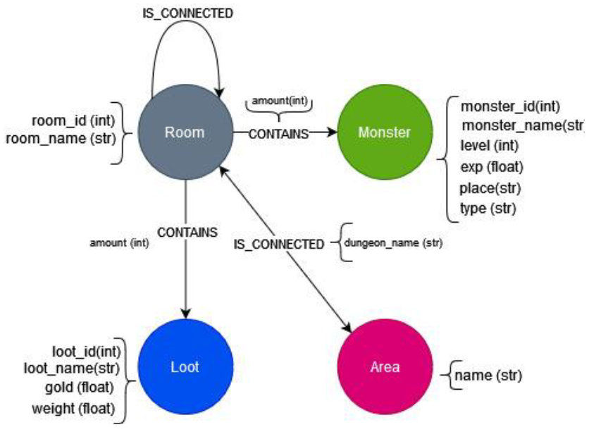

<div align="center">

--- 

# Base de Datos II
## Práctica de Cassandra
### Pablo Ariño, Álvaro Laguna, Jorge de la Rosa
### Ciencia de Datos e Inteligencia Artificial


---
</div>

<p align="center">
  
</p>
<p align="center">
  Figura 1: Esquema de la base de datos
</p>


# Solución
## Desde la interfaz web
### 1. Buscar todas las salas de todas las mazmorras que contengan un tesoro en particular.
```cypher
MATCH (r:Room)-[:CONTAINS]->(l:Loot)
WHERE l.name = "Net"
RETURN r;
```
### 2. Obtener todos los monstruos que hay en una sala en particular.
```cypher
MATCH (r:Room)-[:CONTAINS]->(m:Monster)
WHERE r.room_name = "crypt "
RETURN m;
```
### 3. Obtener todos los monstruos que no están presentes en ninguna sala.
```cypher
MATCH (m:Monster)
WHERE NOT ()-[:CONTAINS]->(m)
RETURN m;
```
### 4. Calcular el camino más corto de un área a otra área.
```cypher
MATCH
  (a:Area {name: "Panicky Desert of Fomalhaut"}),
  (b:Area {name: "Terrible River of Gandalf"}),
  p = shortestPath((a)-[:IS_CONNECTED*]->(b))
RETURN length(p)
```
### 5. Mostrar los enemigos que es necesario derrotar para ir de un área del juego a otra por el camino más corto.
```cypher
MATCH
  (a:Area {name: "Panicky Desert of Fomalhaut"}),
  (b:Area {name: "Terrible River of Gandalf"}),
  p = shortestPath((a)-[:IS_CONNECTED*]->(b))
MATCH (r:Room)-[:CONTAINS]->(m:Monster)
WHERE r IN nodes(p)
RETURN m;
```
### 6. Crear una nueva arista que conecta las distintas áreas del juego, las aristas deben tener un atributo peso con la longitud del camino más corto que unen las dos áreas.
```cypher
MATCH (a: Area),
      (b: Area),
      (a)-[ca:IS_CONNECTED]->(),
      ()-[cb:IS_CONNECTED]->(b),
       p = shortestPath((a)-[:IS_CONNECTED*]->(b))
WHERE a <> b AND ca.dungeon_name = cb.dungeon_name
MERGE (a)-[r:SHORTEST_PATH{length: length(p)}]->(b);
```
### 7. Mostrar el mapa-mundi del juego, es decir, las áreas que contiene y como están conectadas.
```cypher
MATCH (a:Area)-[r:CONNECTED_TO]->(b:Area)
RETURN a, r, b;
```
### 8. Crear un atributo nuevo en las habitaciones que contenga el nombre de la mazmorra a la que pertenecen.
Primero, se crea una proyección de la base de datos dejando solo los nodos de tipo Room y las relaciones de tipo IS_CONNECTED.
```cypher
CALL gds.graph.project('roomGraph', 'Room', 'IS_CONNECTED');
```
Luego, se escribe en la base de datos el atributo componentId
```cypher
CALL gds.wcc.write('roomGraph', { writeProperty: 'componentId' })
YIELD nodePropertiesWritten, componentCount;
```
Finalmente, se escribe en la base de datos el atributo dungeon_name
```cypher
MATCH (a: Area)-[i: IS_CONNECTED]->(r: Room)
WITH i.dungeon_name AS dungeon_name, r
MATCH (r2: Room)
WHERE r2.componentId = r.componentId
SET r2.dungeon_name = dungeon_name;
```
Opccionalmente, se puede borrar el atributo componentId
```cypher
MATCH (r: Room)
REMOVE r.componentId;
```

## Desde Python

Las queries se encuentran en el siguiente [notebook](./sources/queries.ipynb)

## Visualización

Las visualizaciones se encuentran en el siguiente [notebook](./sources/visualization.ipynb)

## Filtro colaborativo

El filtro colaborativo se encuentra en el siguiente [notebook](./sources/collaborative_filtering.ipynb)