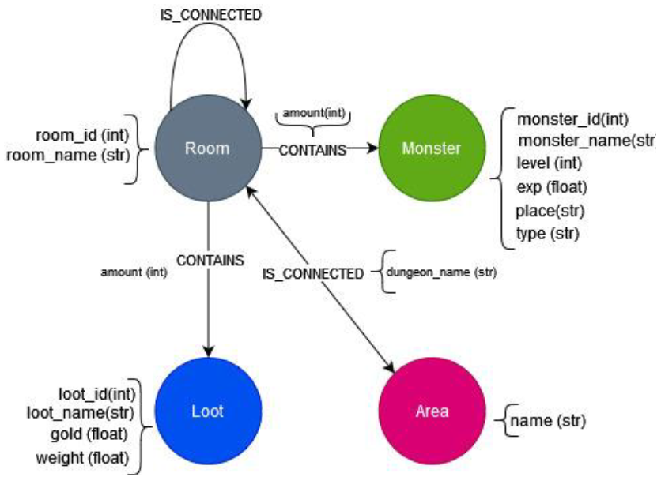

## Tareas

<p align="center">
  
</p>
<p align="center">
  Figura 1: Esquema de la base de datos
</p>

### Desde la interfaz web
1. Buscar todas las salas de todas las mazmorras que contengan un tesoro en particular.
```cypher
MATCH (r:Room)-[:CONTAINS]->(l:Loot)
WHERE l.name = "Net"
RETURN r;
```
2. Obtener todos los monstruos que hay en una sala en particular.
```cypher
MATCH (r:Room)-[:CONTAINS]->(m:Monster)
WHERE r.room_name = "crypt "
RETURN m;
```
3. Obtener todos los monstruos que no están presentes en ninguna sala.
```cypher
MATCH (m:Monster)
WHERE NOT ()-[:CONTAINS]->(m)
RETURN m;
```
4. Calcular el camino más corto de un área a otra área.
```cypher
MATCH
  (a:Area {name: "Panicky Desert of Fomalhaut"}),
  (b:Area {name: "Terrible River of Gandalf"}),
  p = shortestPath((a)-[:IS_CONNECTED*]->(b))
RETURN length(p)
```
5. Mostrar los enemigos que es necesario derrotar para ir de un área del juego a otra por el camino más corto.
```cypher
MATCH
  (a:Area {name: "Panicky Desert of Fomalhaut"}),
  (b:Area {name: "Terrible River of Gandalf"}),
  p = shortestPath((a)-[:IS_CONNECTED*]->(b))
MATCH (r:Room)-[:CONTAINS]->(m:Monster)
WHERE r IN nodes(p)
RETURN m;
```
6. Crear una nueva arista que conecta las distintas áreas del juego, las aristas deben tener un atributo peso con la longitud del camino más corto que unen las dos áreas.
```cypher
MATCH (a: Area),
      (b: Area),
      (a)-[ca:IS_CONNECTED]->(),
      ()-[cb:IS_CONNECTED]->(b),
       p = shortestPath((a)-[:IS_CONNECTED*]->(b))
WHERE a <> b AND ca.dungeon_name = cb.dungeon_name
MERGE (a)-[r:CONNECTED_TO{weight: length(p)}]->(b);
```
7. Mostrar el mapa-mundi del juego, es decir, las áreas que contiene y como están conectadas.
```cypher
MATCH (a:Area)-[r:CONNECTED_TO]->(b:Area)
RETURN a, r, b;
```
8. Crear un atributo nuevo en las habitaciones que contenga el nombre de la mazmorra a la que pertenecen.
```cypher
```